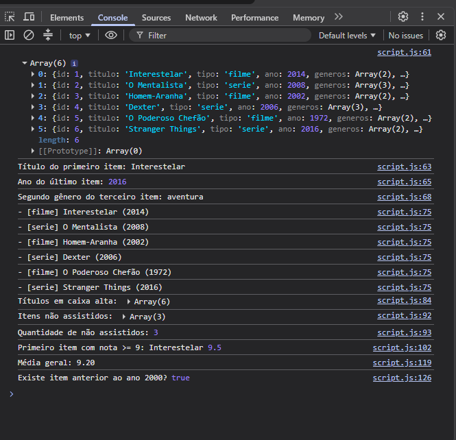

# Atividade Prática - Objetos e Arrays (JSON)

## Aluno

**Nome:** Wallace Gabriel Moreira da Silva

**Matrícula:** 929805

## Descrição

Atividade prática sobre manipulação de objetos e arrays utilizando JavaScript e JSON.

Foram utilizados os métodos:

- forEach
- map
- filter
- find
- reduce
- some
- every

## Console

Print do Console mostrando a listagem dos títulos, cálculo das médias e checagens com some e every.

## Página

Print da página mostrando o resumo do catálogo.

